  # SundayMarket.ai

  This is a code bundle for SundayMarket.ai. The original project is available at https://www.figma.com/design/M4GDJToLDL809hrEZOjrIg/SundayMarket.ai.

  live preview here. 
  https://indent-cat-36116507.figma.site/

  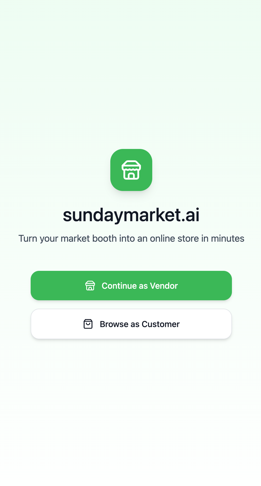
  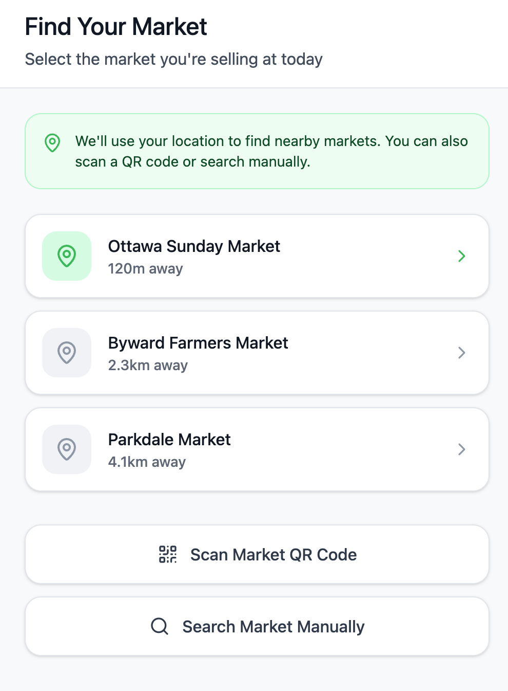
  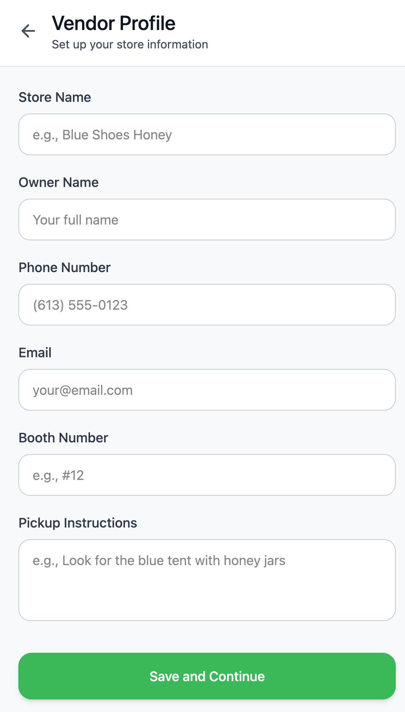
  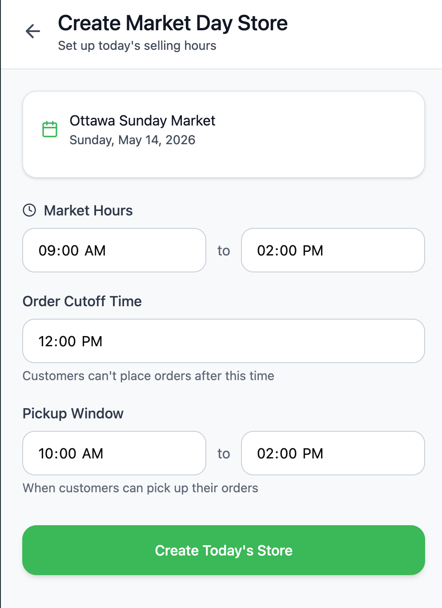
  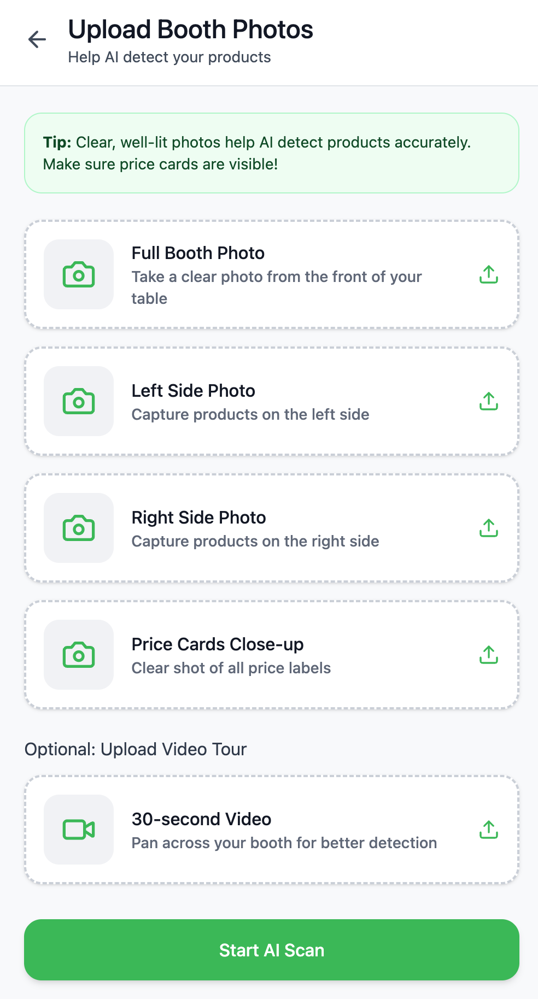
  

  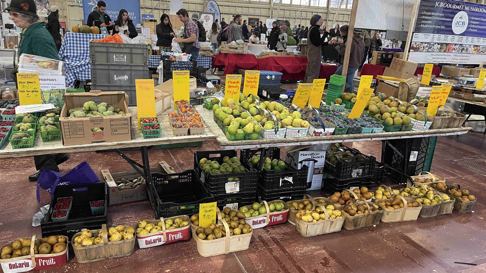
  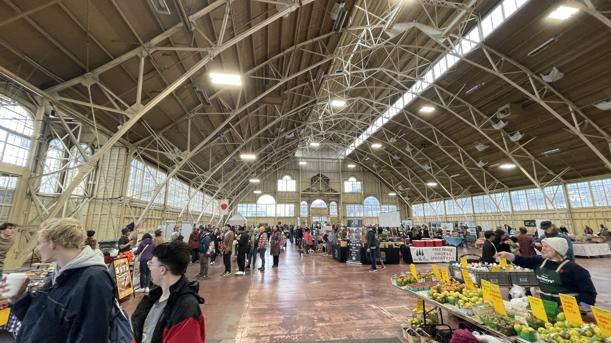
  

  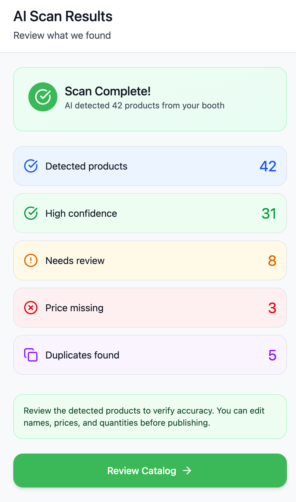
  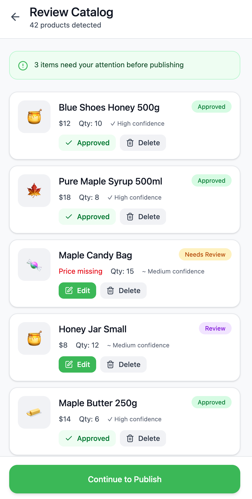
  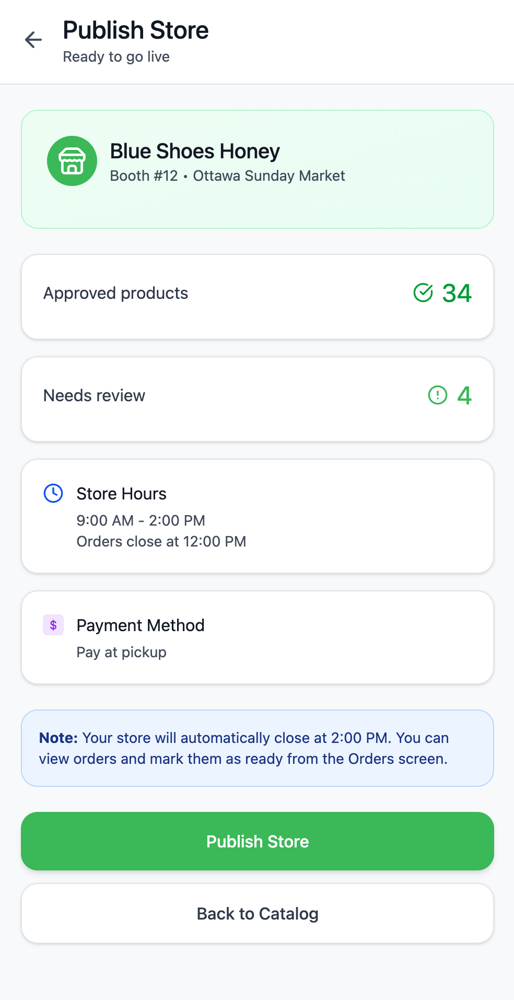
  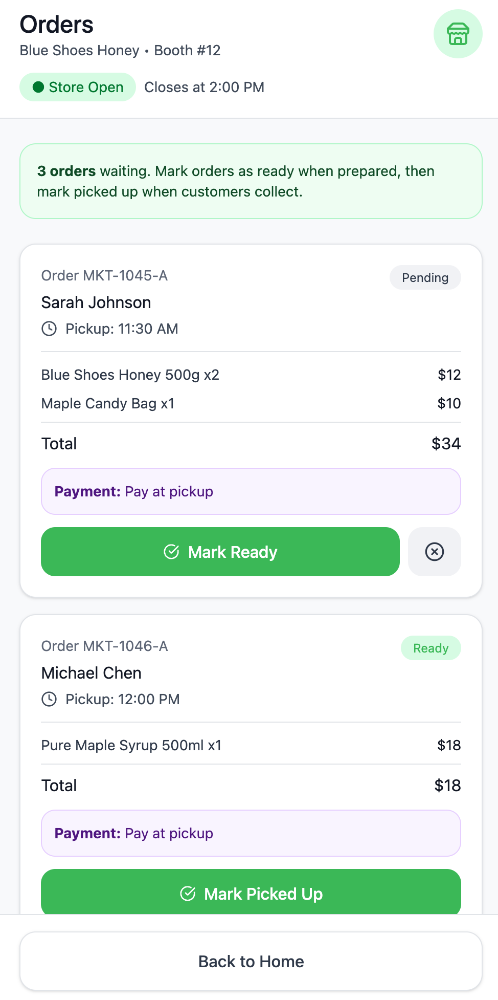

  Customer flow
  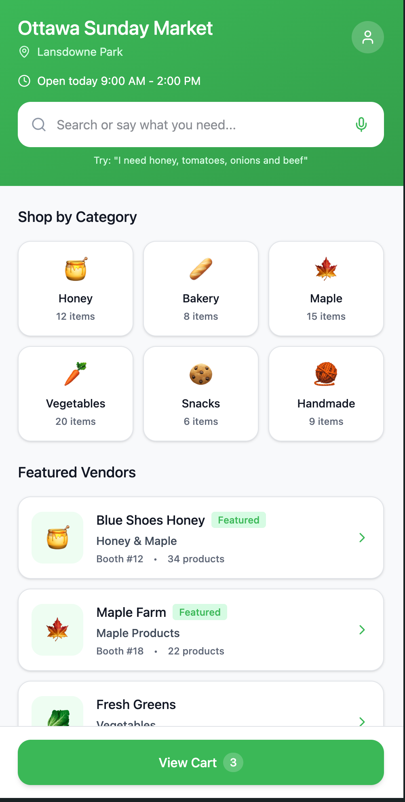
  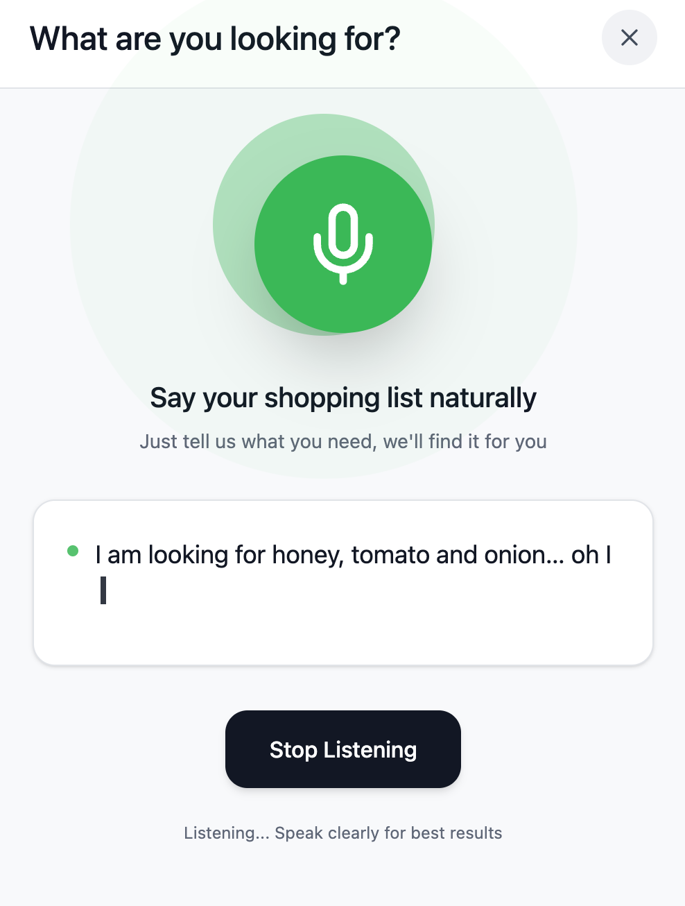
  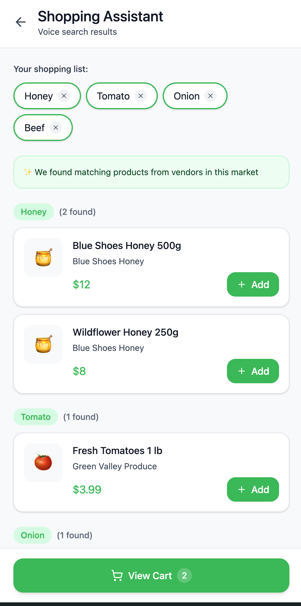
  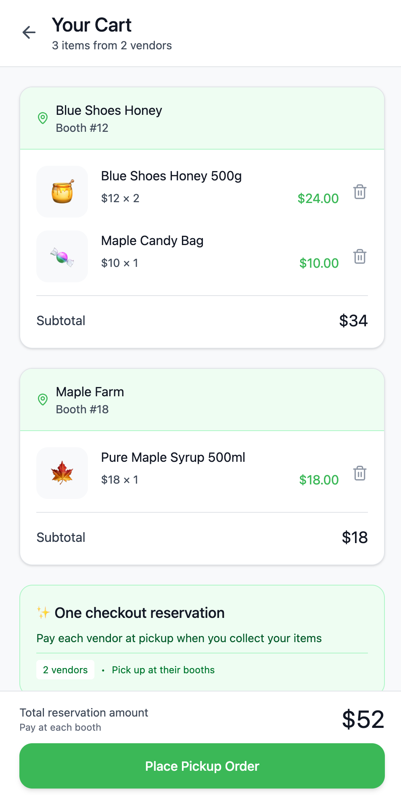
  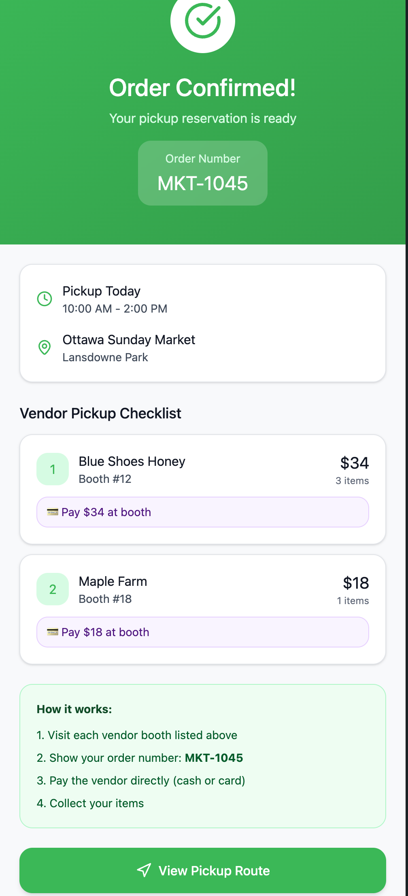
  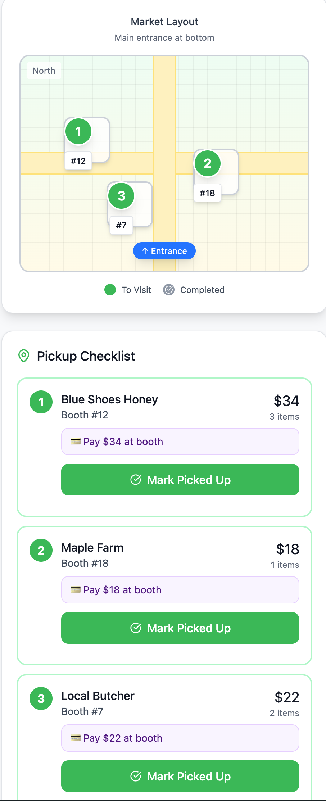

  ## Running the code

  Run `npm i` to install the dependencies.

  Run `npm run dev` to start the development server.
  